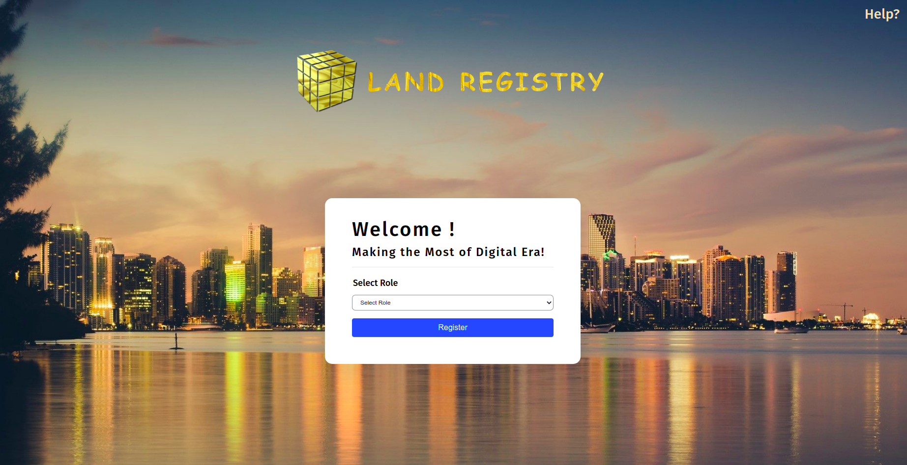
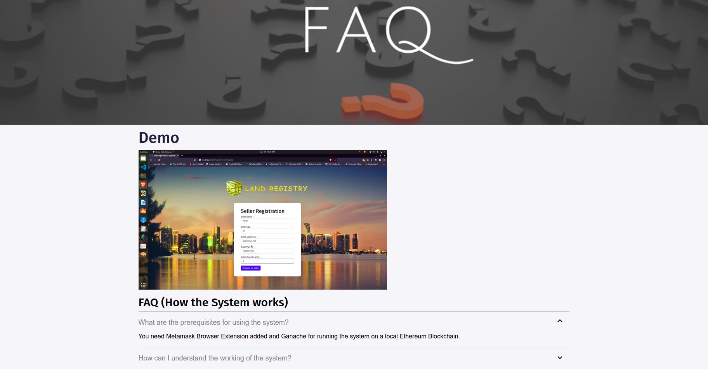
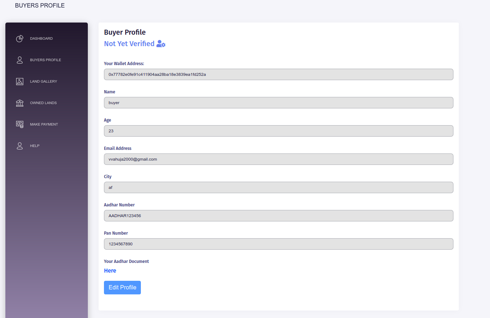

# Rfp Registration System with Blockchain  

 

## Project Description:

This is an application of Rfp Registration System. 
Rfp registry in India as well as in many parts of the world is a very slow and inconvenient process. Current rfpp registration & verification systems include an increasing number of fraud cases and loss of paperwork and court cases due to thousands of rfpp records to maintain.  
The intuition behind building this was to make the process of rfpp registration resilient and decreases the cases of fraud in the process. Using the system, validation of the rfps is also possible as immutable transactions are being stored in the public ledger.  
So the Rfp Registration system using blockchain is a distributed system that will store all the transactions made during the process of rfpp buying. This will also be helpful for agencys, shhqs and government registrars to transfer the rfpp ownership from shhq to new agency as well as it will accelerate the process of registration.  

## Tech Stack Used:

	Frontend:
	* Javascript
    * React Framework
	* CSS
    * Metamask Chrome Extension

	Backend:
	* Ethereum Blockchain (Truffle Suite)
    * Solidity
    * Ganache

## Application features:  

* **Registration Page**: Shq & Agency can register for an account on the application. 
* **Rfp Inspector Dashboard**: Rfp Inspector works as the admin and is already registered. He can then verify the Shqs, Agencys and approve Rfp Transfer Process.
* **User Profile**: Shq & Agency can view their profile via their respective Dashboards.
* **Edit Profile**: Shq & Agency can edit their profile.
* **Shq Dashboard**: A Brief Description of Added Lands and features to Add a new Rfp and approve a Rfp request from a Agency.
* **Add Rfp**: Shq can add a rfpp after he/she is verified by the Rfp Inspector.
* **Approve Rfp Request**: Approve a Request by Agency to Buy a Rfp.
* **Agency Dashboard**: A Brief Description of all Lands and features to Request a Rfp to Rfp Owner of the particular Rfp. 
* **Owned Rfps**: Details of Lands owned by the Agency after Buying some rfps.
* **Make Payment**: Complete Payment transfer to Shq after Rfp Request is approved.
* **View Lands**: Complete Information of Lands along with its Images and Required Documents.
* **Rfp Ownership Transfer**: Transfer of Rfp Ownership from Shq to Agency via Rfp Inspector.  

## Steps to run the application:
1. Clone the github repository and cd to the folder 
2. Open _Ganache_ and keep it running in the Background.
3. Make sure you have Metamask Extension in your browser.
4. In the root directory run _truffle migrate --reset_.
5. cd to the _client_ folder and run _npm install_.
6. Run _npm start_.

## [Project Demo Link](https://youtu.be/6VLaAa8GNDc)

## Some features of the application:-

Landing Page                   |                   Agency Registration
:---------------------------------:        |      :------------------------------:
  | 

Agency Dashboard                   |                   Shq Dashboard
:---------------------------------:        |      :------------------------------:
     |

Add Rfp(by Shq)            |                   View all Lands Details
:---------------------------------:        |      :------------------------------:
     |

Help & FAQ Page                |                   Verify Agency(by Rfp Inspector)
:---------------------------------:        |      :------------------------------:
     |

Approve Rfp Request(by Shq)               |             Payment by Agency 
:---------------------------------:        |      :------------------------------:
     |

Verify Rfp Transaction(by Rfp Inspector)    |                   Owned Rfps(Agency)
:---------------------------------:        |      :------------------------------:
     |

View Profile(Before Verification)                  |             Edit Profile(After Verification)
:---------------------------------:        |      :------------------------------:
     |

### Make sure to star the repository if you find it helpful!

